# BedLink

**Find the right bed. Right now.**

> Team **Rise Together** · Problem statement **5. Healthtech: BedLink**
>
> **Live app:** https://bed-link-pi.vercel.app  ·  **API:** https://bedlink.onrender.com/api/health

## Table of contents

1. [Project Overview](#1-project-overview)
2. [Setup & Installation Instructions](#2-setup--installation-instructions)
3. [Key Features](#3-key-features)
4. [Technology Stack](#4-technology-stack)
5. [Architecture / Workflow](#5-architecture--workflow)
6. [Dataset / API Information](#6-dataset--api-information)
7. [Screenshots / Demo Information](#7-screenshots--demo-information)
8. [Limitations & Future Scope](#8-limitations--future-scope)
9. [Team Members](#9-team-members)

---

## 1. Project Overview

An ambulance crew carrying a critical patient needs the **nearest hospital that has the right
bed right now**: ICU, ventilator, oxygen, or a specialty such as cardiac or burns. Today crews
phone hospital after hospital, or arrive only to be turned away, and lose minutes the patient
doesn't have.

BedLink is a real-time bed coordination platform built in three parts, as the problem statement asks:

| Part | What BedLink does |
|---|---|
| **10-second bed update** (hospital nurses) | One tap per bed (Available / Occupied / Cleaning / Unavailable), plus **Confirm all beds are current** when nothing changed. Built for phones first, and also works on tablets and desktops. |
| **Dispatch & ranking** (ambulance crew) | The crew enters the patient's needs (bed type, equipment, specialty, urgency) and location. BedLink ranks hospitals by **bed match, estimated travel time, data freshness and current load**, and explains each rank. |
| **Confirm-and-hold** | The chosen hospital has **2 minutes** to accept or reject. On accept, the bed is **locked for the ambulance**. On reject or timeout, the **next-best hospital is offered automatically**. |

**Every listing shows how many minutes old its data is.**

Every hospital and ambulance is checked by an **admin verification desk** before going live.
A public **Book an ambulance** page lets families request help without logging in.

There is no demo or dummy data in the app. Everything comes from MongoDB: the hospitals and
ambulances that register and get approved.

## 2. Setup & Installation Instructions

### Prerequisites

- **Node.js 20+** and npm
- **MongoDB**: a free MongoDB Atlas cluster, or a local `mongod` running as a replica set (BedLink uses transactions for the bed lock)

### 1. Clone

```bash
git clone https://github.com/umar-ali-shaikh/T26-Bedlink.git
cd T26-Bedlink
```

### 2. Backend (`server/`)

```bash
cd server
npm install
cp .env.example .env
# edit .env:  MONGO_URI=...   JWT_SECRET=<32+ random characters>   CLIENT_ORIGIN=http://localhost:5173
npm run dev                   # http://localhost:5000/api/health
```

Generate a secret with `node -e "console.log(require('crypto').randomBytes(48).toString('hex'))"`.
Every variable is documented in [`server/.env.example`](server/.env.example).

### 3. Frontend (`client/`)

Start it in a second terminal:

```bash
cd client
npm install
npm run dev                   # http://localhost:5173
```

In development, Vite proxies `/api` and `/socket.io` to `http://localhost:5000`, so no CORS
setup is needed. You can also open the hospital screen from a phone on the same Wi-Fi.
Client settings are in [`client/.env.example`](client/.env.example).

### 4. Create the first admin

```bash
cd server
npm run admin -- create you@example.com "Your Name"   # asks for the password (hidden, 10+ chars)
npm run admin -- list                                  # list admins
npm run admin -- disable you@example.com               # block an admin
```

Running `create` again with the same email resets that admin's password. Instead of this
command you can set `ADMIN_EMAIL` and `ADMIN_PASSWORD`, and the server creates the admin at
startup.

If you see `querySrv ECONNREFUSED`, your network's DNS can't resolve the Atlas address.
BedLink retries once through public DNS. If it still fails, set `DNS_SERVERS=8.8.8.8,8.8.4.4`
and allow your IP in Atlas → Network Access.

### 5. Use it

1. Open http://localhost:5173 → **Register** a hospital or an ambulance.
2. Log in as the admin → **`/admin/verifications`** → approve them.
3. **Hospital:** add beds and keep their status current.
4. **Ambulance:** New emergency → enter needs and location → **Find beds** → **Request bed**.

### Scripts

| Where | Command | What it does |
|---|---|---|
| server | `npm run dev` / `npm start` | API + Socket.IO server (nodemon in dev) |
| server | `npm test` | Vitest: matching unit tests plus API, concurrency, timeout/fallback, booking and socket integration tests |
| server | `npm run lint` / `npm run format` | ESLint / Prettier |
| server | `npm run admin -- …` | Create, list or disable admins in MongoDB |
| server | `npm run hospitals -- …` | Verify or reject hospitals and ambulances from the terminal |
| server | `npm run demo:purge` | Remove sample data left by old versions |
| client | `npm run dev` / `npm run build` / `npm run preview` | Vite dev server / production build / preview |

Tests start an in-memory MongoDB replica set, which is downloaded on the first run. When you
are offline, point the tests at a local binary: `MONGOMS_SYSTEM_BINARY=/path/to/mongod npm test`.

If you run a standalone local `mongod` (no replica set), set `MONGO_TRANSACTIONS=false`. The
bed lock then relies on atomic updates plus compensation (see docs/ARCHITECTURE.md §13.3).

### Deployment

Everything is configured through environment variables. The steps for each option are in
[docs/DEPLOYMENT.md](docs/DEPLOYMENT.md).

- **Vercel + Render** (the live setup):
  - **Client on Vercel** with `VITE_API_URL=https://<api>/api` and `VITE_SOCKET_URL=https://<api>`.
  - **API on Render** with `NODE_ENV=production`, `MONGO_URI`, `JWT_SECRET` and `CLIENT_ORIGIN=https://<vercel-app>`.
- **One URL:** Render → New → Blueprint → this repo. [`render.yaml`](render.yaml) builds the client and serves the API and the app from one service.

## 3. Key Features

**Hospital panel** (sidebar on desktop, bottom tabs on phones and tablets)
- One-tap bed status with optimistic updates and Undo. **Confirm all beds are current** refreshes freshness in one tap.
- An incoming request card with a live 2-minute countdown and an alert sound, plus Accept / Reject with a reason.
- Current-load control (Low / Moderate / High / Critical), which ambulances see.
- Active reservations, with **Patient arrived** and **Release** actions.
- The hospital profile: departments, contact, ownership (Government / Semi-government / Private) and verification status.

**Ambulance panel**
- A new-emergency form: bed type, equipment, specialties, urgency, and patient location by address search or GPS.
- **Explainable ranking.** Each hospital shows:
  - its match score
  - ETA and distance
  - a confidence badge
  - **"Updated N minutes ago"**
  - reasons ("ICU available (2 beds)", "Ventilator available"…)
  - why other hospitals were excluded
  - a map
- Request bed → a live status timeline → automatic fallback to the next hospital → reservation details and hospital contact.
- On-duty toggle with live GPS sharing, so the crew receives public bookings nearby.

**Public booking (no login)**
- `/book`: patient name, phone, pickup location and problem. BedLink finds the nearest on-duty ambulance and alerts a matching hospital.
- `/track/:token`: a live tracking link for the family.
- Protection against prank bookings:
  - rate limits per IP address and per phone number
  - crews can report a fake booking, and repeat offenders are blocked for a while
  - personal details are deleted after the retention period

**Admin verification desk** (`/admin/verifications`)
- Hospitals and ambulances start **PENDING**. Admins see:
  - all details, with links (map, ABDM facility search, Parivahan Sarathi, phone)
  - a checklist
  - **Approve / Reject**, where a reason is required
- Approval reaches the applicant's screen live.
- Automatic checks at sign-up:
  - formats
  - unique registration number, HFR ID, vehicle number, licence and email
  - no hospital with the same name within 1 km

**Platform**
- Real-time updates over Socket.IO: bed changes, offers, decisions, verification and connection status.
- **No double booking.** The accepted bed is locked inside a MongoDB transaction.
- A background sweeper expires timed-out offers and holds, and recovers timers after a restart.
- Email + password login with cookie-based JWT auth with role guards (ADMIN / DISPATCHER / HOSPITAL). Helmet CSP, rate limits, and Zod validation on every request.
- Responsive on desktop, tablet and phone.

## 4. Technology Stack

| Layer | Technology |
|---|---|
| Frontend | React 18, Vite 5, Tailwind CSS 3, TanStack Query 5, React Router, socket.io-client, React-Leaflet (OpenStreetMap), lucide-react, Zod |
| Backend | Node.js 20+, Express 5, Socket.IO 4, Mongoose 9, Zod 4, bcrypt, jsonwebtoken, helmet, express-rate-limit |
| Database | MongoDB Atlas (replica set: transactions, geo and partial unique indexes, TTL indexes) |
| Location | OpenStreetMap Nominatim geocoding (proxied, cached and rate-limited by the server); browser Geolocation API |
| Testing & quality | Vitest, Supertest, mongodb-memory-server, ESLint, Prettier |
| Hosting | Vercel (client), Render (API + WebSockets), MongoDB Atlas |

## 5. Architecture / Workflow

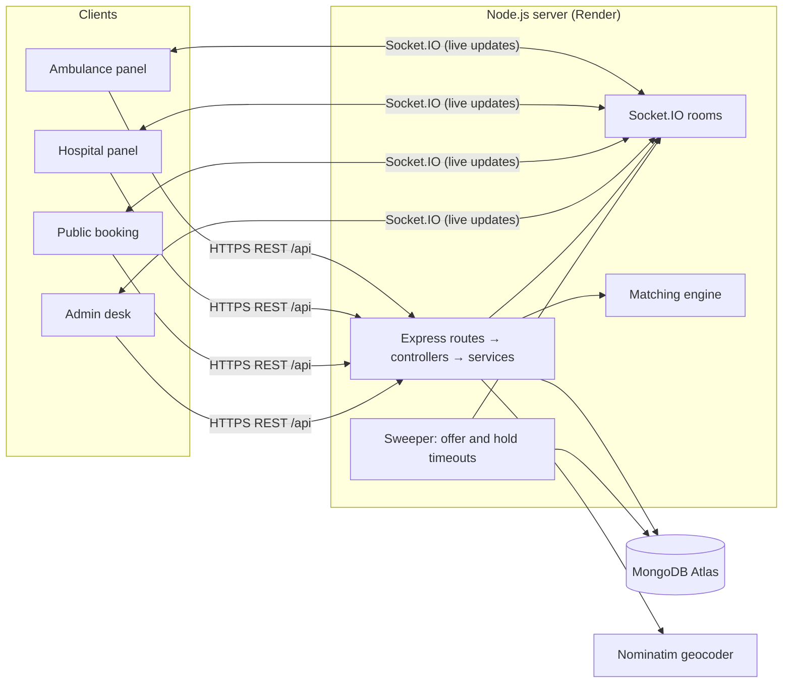

**Emergency workflow (confirm-and-hold):**

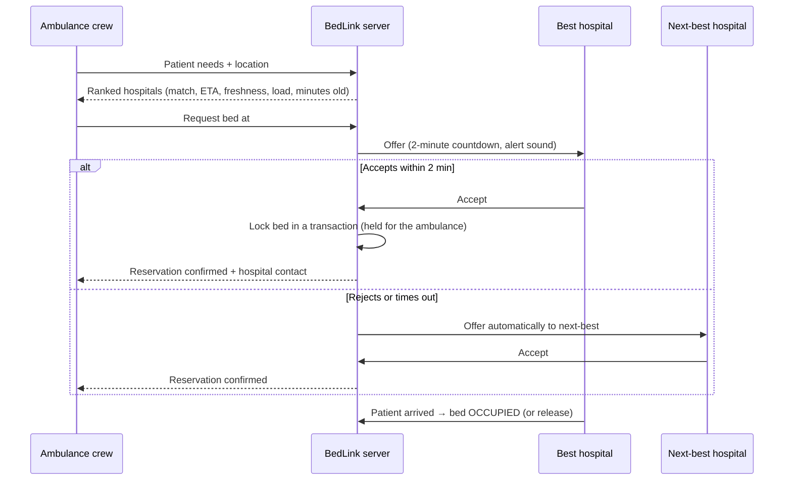

**Ranking.** Each hospital's score from 0 to 100 is:

`50% bed match + 25% travel time + 15% data freshness + 10% (1 − current load)`

Each part works as follows:
- **Freshness:** data is fresh for 2 minutes and recent up to 10 minutes; after that it is stale and ranks lower.
- **Travel time:** distance × road factor ÷ average ambulance speed.
- **Excluded hospitals:** hospitals beyond the radius or ETA limit, at critical load, or without the required bed are excluded, and the reason is shown.

All of these values can be changed through environment variables.

**Code layout**

```text
client/   React + Vite app — features/, pages/, layouts/, components/, socket/, services/
server/   Express + Socket.IO — routes → controllers → services → repositories → models
          services/matching (ranking), services/emergency (offers, fallback), services/reservation (bed lock),
          services/booking (public bookings), services/verification, sockets/, utils/ (CLIs)
docs/     PRD, ARCHITECTURE, DESIGN, RULES, PHASES, DEPLOYMENT, MEMORY
Application overview/   Team, problem statement and project details
```

More detail is in the project documents:

| Doc | What it covers |
|---|---|
| [docs/PRD.md](docs/PRD.md) | Product requirements, features, scope |
| [docs/ARCHITECTURE.md](docs/ARCHITECTURE.md) | Models, API, sockets, matching, concurrency, security |
| [docs/DESIGN.md](docs/DESIGN.md) | Design system and screens |
| [docs/RULES.md](docs/RULES.md) | Engineering rules |
| [docs/PHASES.md](docs/PHASES.md) | Build plan and acceptance criteria |
| [docs/DEPLOYMENT.md](docs/DEPLOYMENT.md) | Deployment options and every environment variable |
| [docs/MEMORY.md](docs/MEMORY.md) | Living project state and decisions |

## 6. Dataset / API Information

**Dataset.** BedLink uses no external or pre-built dataset. All data is live and created by its users:

| Data | Source |
|---|---|
| Hospitals, departments, ownership, location | Hospital self-registration, then admin verification |
| Beds and their status | Hospital staff (one-tap updates) |
| Ambulances, driver, licence, vehicle | Ambulance self-registration, then admin verification |
| Emergencies, offers, reservations, bookings | Created while the app is used |

On startup the server removes sample data that older versions loaded (`PURGE_DEMO_DATA`,
default on). The fictional hospitals used by the automated tests live only in `server/tests/fixtures/`.

**External APIs**

| API | Used for |
|---|---|
| OpenStreetMap **Nominatim** | Address or place-name search, and reverse geocoding from GPS. The server proxies it at `GET /api/geocode/search` and `/reverse`. Results are cached, rate-limited and limited to India by default (`GEOCODER_URL`, `GEOCODER_EMAIL`, `GEOCODER_COUNTRY`). |
| OpenStreetMap tiles | Maps (Leaflet) |
| ABDM Health Facility Registry, Parivahan Sarathi | Reference links on the admin desk, used for manual checks only |

**BedLink REST API.** Every route is under `/api`. Responses look like `{ success, data }` or `{ success: false, message, code }`.

| Area | Main endpoints |
|---|---|
| Auth | `POST /auth/login`, `/auth/register/hospital`, `/auth/register/ambulance`, `/auth/logout`, `GET /auth/me` |
| Hospitals & beds | `GET /hospitals`, `PATCH /hospitals/:id`, `GET/POST /hospitals/:id/beds`, `POST /hospitals/:id/beds/confirm`, `PATCH /beds/:id` |
| Emergencies | `POST /emergencies` (ranks hospitals), `POST /emergencies/:id/request-hospital`, `GET /emergencies/:id`, `POST /emergencies/:id/cancel` |
| Hospital requests | `GET /hospital-requests`, `POST /hospital-requests/:id/accept`, `/reject` |
| Reservations | `POST /reservations/:id/arrive`, `/release` |
| Public booking | `POST /bookings`, `GET /bookings/track/:token`, ambulance booking offers |
| Admin | `GET /admin/verifications/summary`, `GET /admin/verifications/hospitals` · `/ambulances`, `POST /admin/verifications/hospitals/:id` · `/ambulances/:id` |
| Utility | `GET /health`, `GET /geocode/search`, `GET /geocode/reverse` |

The full contract, including socket events, is in [docs/ARCHITECTURE.md](docs/ARCHITECTURE.md).

## 7. Screenshots / Demo Information

**Live demo:** https://bed-link-pi.vercel.app. Register a hospital or an ambulance. An admin
then approves it at `/admin/verifications`. The public booking page is at `/book`.

The screenshots below come from a local run with sample registrations. The map area shows no
tiles because the machine that took them had no internet access.

| | |
|---|---|
| **Login** 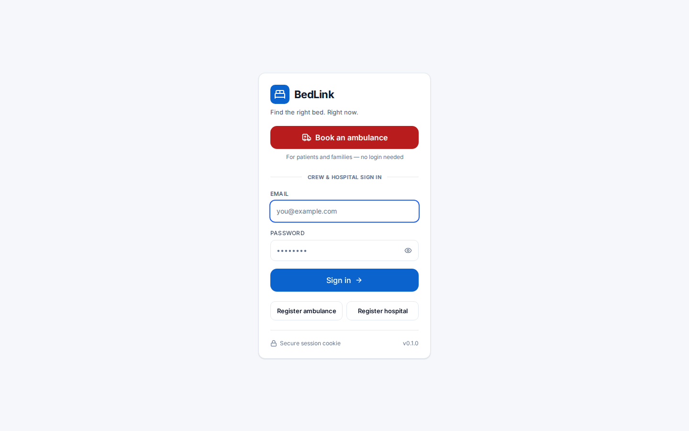 | **Register: choose a panel** 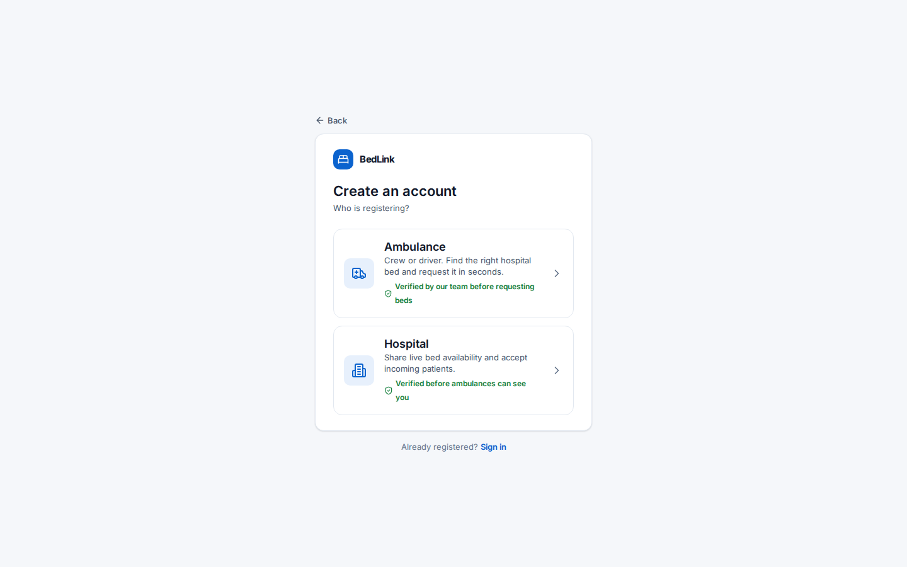 |
| **Ambulance overview** 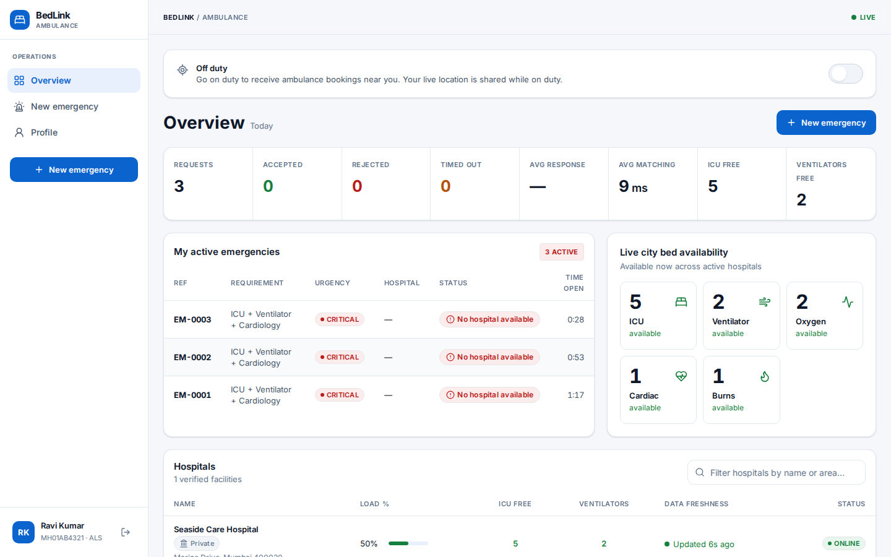 | **Ranked hospitals with reasons and freshness** 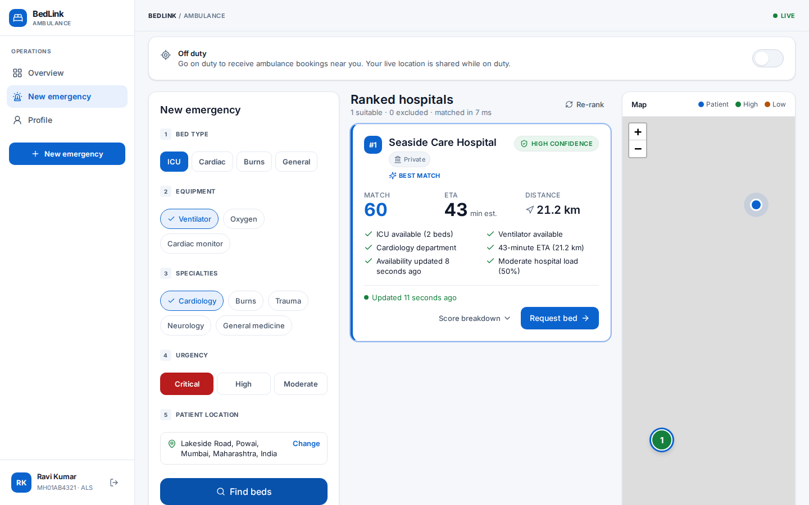 |
| **Admin verification desk** 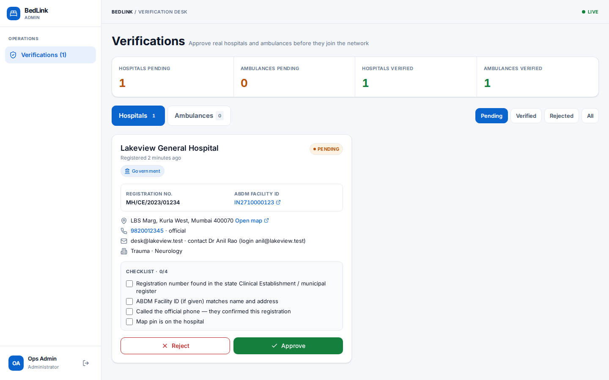 | **Hospital dashboard (desktop)** 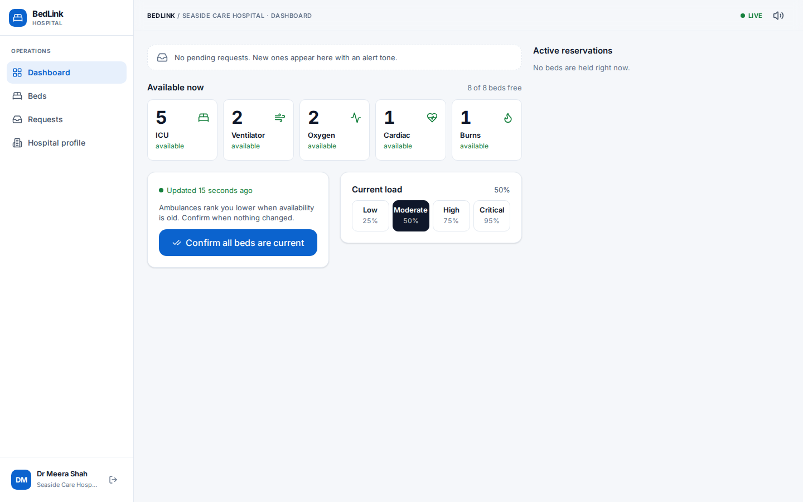 |
| **One-tap bed updates (desktop)** 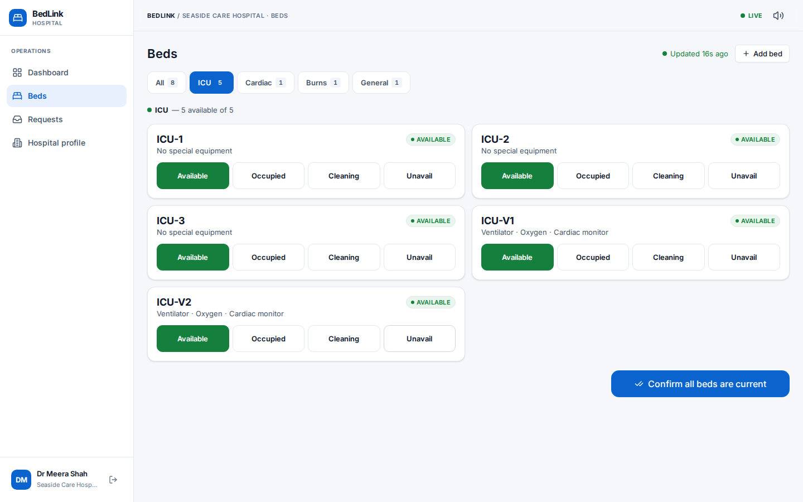 | **Bed updates on a phone** · **Public booking** <br> 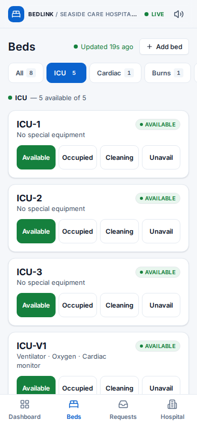 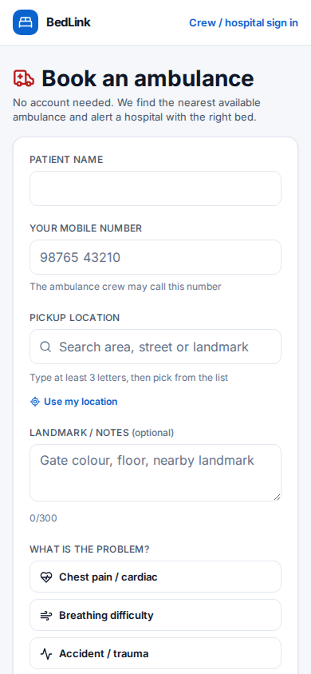 |

**A demo in 2 minutes:**
1. A hospital nurse marks ICU beds available.
2. The ambulance crew creates a new emergency (ICU + ventilator) and searches the location.
3. The ranked list shows match, ETA and "updated N min ago".
4. The crew requests a bed at #1. The hospital gets an alert with a 2:00 countdown.
5. The hospital rejects, or lets the timer run out, and #2 is offered automatically.
6. The hospital accepts. The bed is held, and the crew sees the reservation and the hospital's phone number.
7. The patient arrives, and the bed becomes Occupied.

## 8. Limitations & Future Scope

**Limitations**
- ETA is estimated from straight-line distance × a road factor ÷ average speed. It does not use live traffic.
- Bed data is only as accurate as hospital staff keep it. BedLink shows its age and ranks stale data lower, but it can't verify beds automatically.
- Verification is manual (an admin checks registers and calls the hospital). There is no direct government registry API integration yet.
- The free hosting tier (Render) sleeps when idle, so the first request after a pause can take about 30–50 seconds.
- Alerts are in-app with sound. There are no SMS, WhatsApp or push notifications yet.
- Nominatim's free public service has usage limits (1 request per second). Heavy use needs a self-hosted or paid geocoder.
- English only.

**Future scope**
- Live-traffic routing (OSRM or Mapbox) for real ETAs and turn-by-turn navigation for crews.
- SMS, WhatsApp and push alerts for hospitals and families, and IVR booking for feature phones.
- Integration with ABDM Health Facility Registry and HMIS / bed-management systems, so beds update automatically.
- A native or PWA app with offline queueing for low-network areas, and Hindi and regional languages.
- Pre-arrival patient vitals and ECG sharing with the receiving hospital.
- City or state command-centre analytics: bed shortages, response times and demand heatmaps.
- Multi-ambulance fleet management and integration with 108 / 112 emergency services.

## 9. Team Members

**Team Rise Together**

| Name | Role |
|---|---|
| Akshay Vishwakarma | Team Leader |
| Umar Ali Shaikh | Member |
| Vansh Tiwari | Member |
| Gaurav Sharma | Member |
